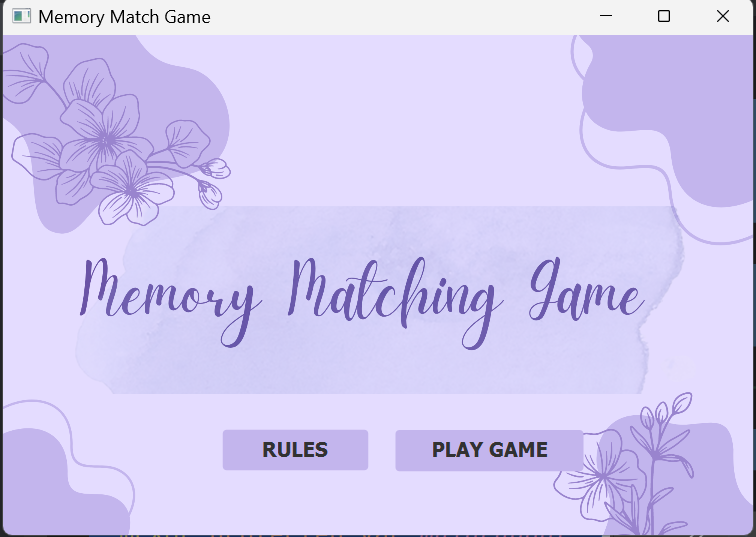
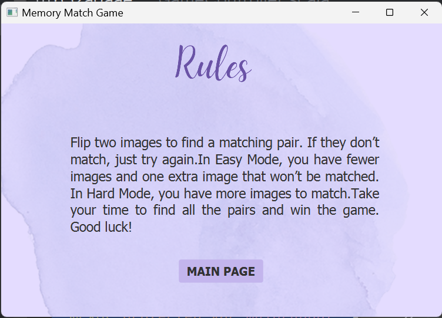
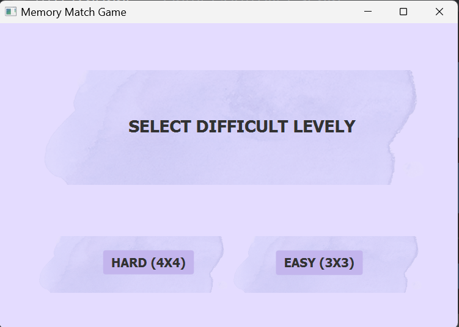
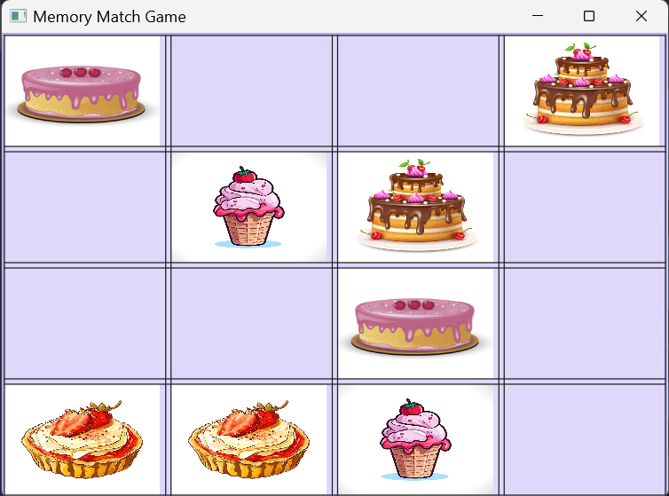
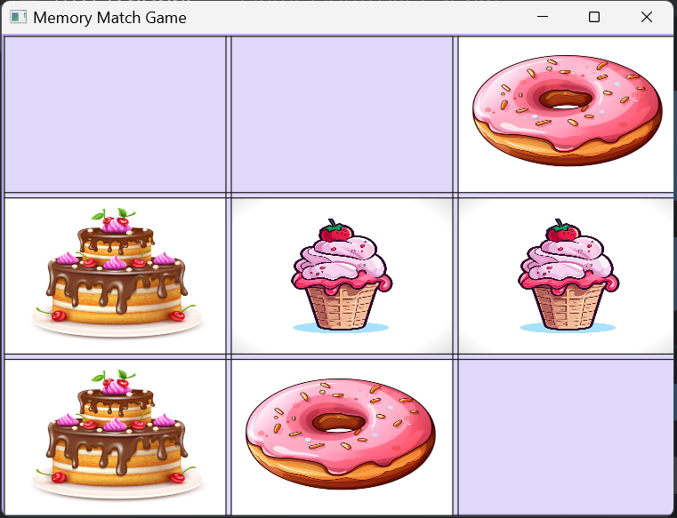

# Cake Memory Matching Game

A fun and visually engaging **Memory Match Game** built using **Scala** and **JavaFX**.  
Players test their memory by matching pairs of cake and sweet icons across two difficulty levels — *Easy* and *Hard*.

---
## Preview(screnshots)

### Main Menu


### Rules


### Difficulty Selection


### Gameplay (4×4 Mode)


### Gameplay (3×3 Mode)

---
## Purpose

This project was developed as part of my software engineering portfolio to demonstrate my skills in **Scala, JavaFX, and object-oriented programming**.  
It focuses on applying clean design patterns, responsive UI handling, and interactive gameplay logic — skills relevant for **Google and other top-tier internships**.

---
## Overview

The Cake Memory Game challenges players to find all matching pairs of images by flipping two cards at a time.  
It combines smooth JavaFX visuals with structured Scala logic to demonstrate clean OOP design, FXML integration, and event handling.

---

## Features

- **Two Difficulty Modes**
    - **Easy Mode (3×3):** Includes an extra image for relaxed gameplay
    - **Hard Mode (4×4):** For players seeking a real challenge

- **Interactive Gameplay**
    - Click cards to reveal images
    - Matching pairs remain visible
    - Unmatched pairs flip back automatically

- **Responsive Design**
    - Works well in 600×400 resolution
    - Supports manual window resizing without breaking the layout

- **Smooth Scene Navigation**
    - Main Menu → Difficulty Selection → Game → Rules
    - Fixed issue where Rules text reappeared after returning to menu

---

## Technologies Used

- **Language:** Scala
- **Framework:** JavaFX
- **Build Tool:** SBT
- **UI Layout:** FXML
- **Styling:** CSS

---

## Project Structure
```text
CakeMemoryGame/
│
├── src/
│ ├── main/
│ │ ├── scala/com/mygame/
│ │ │ ├── MyApp.scala
│ │ │ ├── controller/
│ │ │ │ ├── MainController.scala
│ │ │ │ ├── DifficultyController.scala
│ │ │ │ ├── GameController.scala
│ │ │ │ ├── EasyGameController.scala
│ │ │ │ └── HardGameController.scala
│ │ ├── resources/com/mygame/view/
│ │ │ ├── MainMenu.fxml
│ │ │ ├── GameDifficulty.fxml
│ │ │ ├── Rules.fxml
│ │ │ ├── easygame.fxml
│ │ │ ├── hardgame.fxml
│ │ │ └── (images & styles)
│ └── test/
│ └── (optional tests)
│
├── build.sbt
└── README.md
```


---

##  How to Run

1. **Clone the repository**
   ```bash
   git clone https://github.com/kirpiim>/cake-memory-matching-game.git
   cd cake-memory-matching-game
   ```
2. **Open in IntelliJ IDEA**

-Import as an SBT project

-Ensure Scala SDK and JavaFX SDK are properly configured

3. **Run the Application**

-Open MyApp.scala

-Click Run

## Gameplay Instructions
Action	Description
-Click	-Flip a card
-Match	-Two identical images stay visible
-Mismatch	-Cards flip back after a short delay
-Win	-All pairs successfully matched

## Learning Outcomes

- Gained hands-on experience with **Scala–JavaFX integration**
- Improved understanding of **FXML scene management and controllers**
- Practiced **event-driven programming and state handling**
- Strengthened skills in **responsive UI design**


## Future Improvements 
-Add timer and scoring system
-Implement background music and sound effects
-Introduce card flip animations
-Add restart and exit buttons
-Optimize for full responsiveness on different screen sizes

